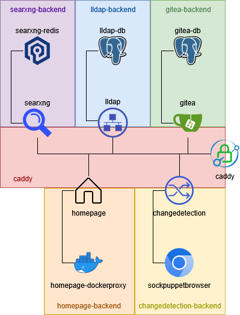

# Homelab Services

These are the services I have running in my homelab. These compose files when combined with my [scripts](#) and [configs](#) repos comprise the entirety of my homelab at this time and how to rebuild it from scratch.

## Conventions

I have made some architectural decisions that impact how I have structured my compose files. I am storing all service related configurations and data under the `/srv` path with this structure:

```
srv/
├── env/
│   ├── caddy.env
│   ├── changedetection.env
│   ├── giteadb.env
│   ├── gitea.env
│   └── ...
├── compose/
│   ├── caddy-cloudflare/
│   │   ├── Dockerfile
│   │   └── compose.yml
│   ├── change-detection/
│   │   └── compose.yml
│   ├── gitea/
│   │   └── compose.yml
│   └── ...
├── caddy/
│   └── Caddyfile
├── gitea/
│   ├── data/
│   └── db/
└── ...
```

This allows for simple conventions in adding new services. Additionally, I am following the below pattern for all compose files, omitting fields as necessary.

```yml
services:
  service_name_1:
    build:
      context: .
      dockerfile: Dockerfile
    image: image_name:tag
    ports:
      - "8080:80"
    env_file:
      - /srv/env/service_name_1.env
    environment:
      - VAR1=value1
      - VAR2=value2
    volumes:
      - /srv/service_name_1/data:/data
    depends_on:
      - service_name_2
    command: "command to execute"
    networks:
      - network_name

networks:
  network_name:
    driver: bridge

volumes:
  data:
```

On the networking side, I am using the `caddy` network as a unified frontend network for Caddy to proxy on, however this may change to service specific frontends down the road. Each service will receive its own backend network if needed. Currently the network diagram looks a bit like this.

